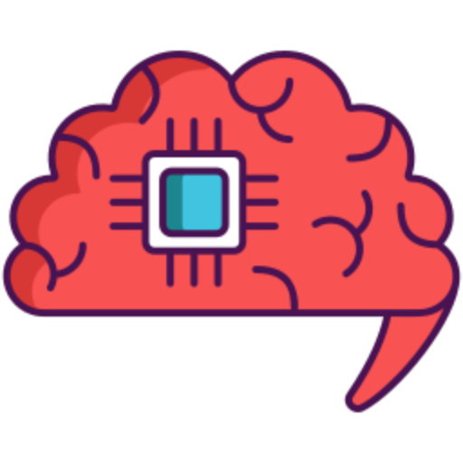

# Second Brain - Landing Page

A modern, responsive landing page for the Second Brain application - your personal knowledge hub for organizing, storing, and sharing digital content.

## 🧠 About Second Brain

Second Brain is a personal knowledge management application that helps you:
- **Organize** your YouTube videos, tweets, and links
- **Store** thoughts, ideas, and information securely
- **Share** content through a powerful dashboard
- **Access** your knowledge from anywhere, anytime

## ✨ Features

### Landing Page Features
- **Modern Design** - Clean, elegant UI with dark theme
- **Responsive Layout** - Optimized for all devices
- **Fast Performance** - Built with Next.js 15 and optimized fonts

## 🚀 Live Demo

- **Production**: [https://brain.secondbrain.sbs](https://brain.secondbrain.sbs)
- **Staging**: [https://second-brain-lp.pages.dev](https://second-brain-lp.pages.dev)

## 🛠️ Tech Stack

- **Framework**: [Next.js 15](https://nextjs.org/) with App Router
- **Language**: TypeScript
- **Styling**: Tailwind CSS
- **Animations**: Framer Motion
- **Icons**: React Icons, Custom SVG components
- **UI Components**: Ant Design
- **Fonts**: Geist Sans & Geist Mono
- **Deployment**: Vercel & Cloudflare Pages

## 👨‍💻 Developer

**Kishan Singh Thakur**
- 🌐 LinkedIn: [kishan-singh-thakur](https://www.linkedin.com/in/kishan-singh-thakur-26b912255/)
- 🐙 GitHub: [KISHANsingh0001](https://github.com/KISHANsingh0001)
- 🐦 Twitter: [@KishanS36200218](https://twitter.com/KishanS36200218)

  
Built with ❤️ by Kishan Singh Thakur

  
© 2025 Second Brain. All Rights Reserved.

